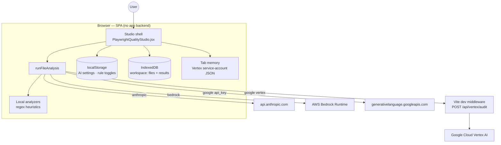
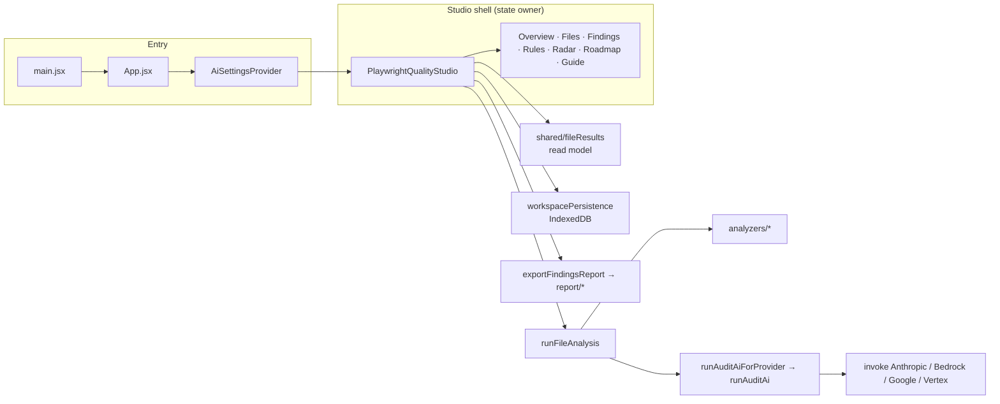
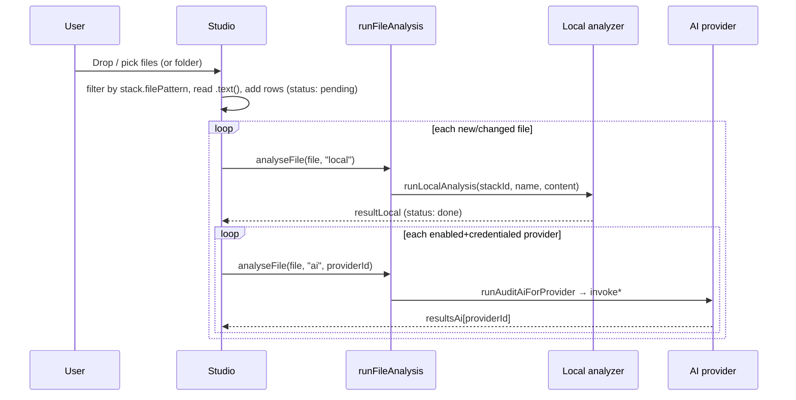
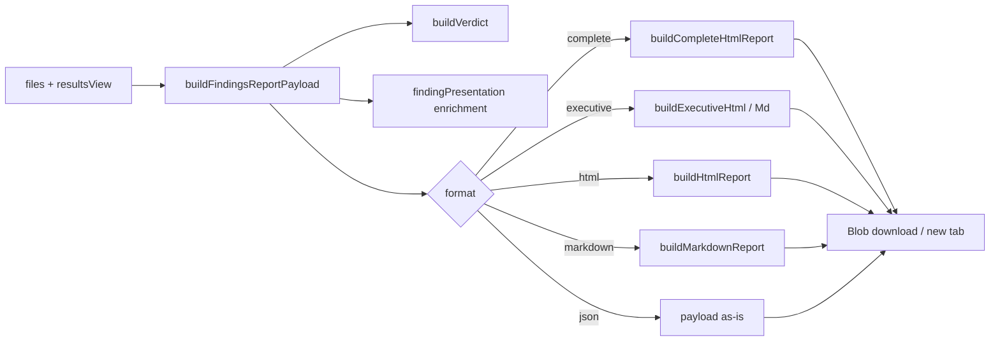

# Code Quality Studio — Architecture

> Authoritative engineering reference for this codebase. Written from a read of the
> source (not aspirational). Last reviewed: 2026-07-28.

---

## 1. What this is

A **client-side single-page application** that audits source files against a catalog of
deterministic "standard rules" and, optionally, one or more **AI providers**, then presents
the results across several views and exports them as HTML / Markdown / JSON reports.

Three **stacks** are supported today, selected in the header:

| Stack id | Files matched | Focus |
|----------|---------------|-------|
| `playwright` | `*.spec.{ts,js,tsx,jsx}`, `*.test.*` | Locators, flakiness, assertions, CI |
| `java_api` | `*.java` | REST, JDBC, security, concurrency, observability |
| `typescript` | `*.ts`, `*.tsx` | Type safety, async I/O, HTTP clients, validation |

Everything runs in the browser. There is **no application backend** — the only server-side
code is a Vite dev-server middleware used exclusively for Google Vertex AI (see §9).

---

## 2. Technology choices

| Concern | Choice | Notes |
|--------|--------|-------|
| UI | React 19 + Vite 8 | JSX, no framework router — a single shell with tab state |
| Language | JavaScript (ESM), not TypeScript | Types documented via JSDoc `@typedef` only |
| Styling | Inline `style={{…}}` objects | No CSS framework; design tokens exist in `shared/theme.js` |
| Local analysis | Hand-written regex/heuristic analyzers | Zero network, runs synchronously in the browser |
| AI | Provider adapters (Anthropic, Bedrock, Google AI Studio, Vertex) | Called directly from the browser (except Vertex) |
| Persistence | `localStorage` (settings/rules) + `IndexedDB` (workspace) | No server state |

---

## 3. System context



Key property: **local rules and browser-key AI providers need no server at all** — a static
`vite build` is fully functional for them. Only Vertex requires `npm run dev`.

---

## 4. Module map

```
src/
  main.jsx                     Entry — mounts <App/> in StrictMode
  App.jsx                      Wraps the studio in <AiSettingsProvider/>
  index.css / App.css          Global styles

  studio/
    PlaywrightQualityStudio.jsx   ★ The shell. Owns nearly all app state and the 7 tabs.

  stacks/
    definitions.js             AUDIT_STACKS — id, file pattern, categories, labels per stack
    registry.js                getAuditStack(id) resolver

  analyzers/
    index.js                   runLocalAnalysis(stackId, …) → dispatch by stack
    playwright.js              → localAnalyzer.js
    javaApi.js / typescript.js Rule engines for those stacks
    analyzerUtils.js           Shared line/regex helpers
  localAnalyzer.js             The Playwright rule engine (largest analyzer)

  rules/
    catalog.js                 Human-readable rule metadata (for the Rules tab)
    ruleSettingsStorage.js     Per-stack enable/disable + notes (localStorage)
    ruleWhyCatalog.js          "Why this rule matters" copy

  services/
    runFileAnalysis.js         ★ Analysis router: mode = local | ai | auto
    ai/
      runAuditAi.js            Provider switch (anthropic | bedrock | google)
      runAuditAiForProvider.js Credential guard + normalizes settings
      invokeAnthropic.js       fetch → api.anthropic.com
      invokeBedrock.js         Lazy-loaded AWS SDK (code-split)
      invokeGoogle.js          AI Studio key OR delegate to Vertex
      invokeGoogleVertex.js    POST to the dev middleware
      parseAuditJson.js        Strip ```json fences, JSON.parse, normalize findings
      safeErrors.js            sanitizeClientError / safeProviderError

  settings/
    aiSettingsDefaults.js      ★ Provider list, credential predicates, mode label logic
    aiSettingsStorage.js       localStorage load/save (strips Vertex SA JSON)
    AiSettingsContext.jsx      React context provider for settings
    googleAuth.js              Google api_key vs vertex credential helpers

  shared/
    fileResults.js             ★ Multi-result read model (views, findings, averages)
    findingActualCode.js       Enrich a finding with the offending source snippet
    findingContextualFix.js    Build a contextual fix suggestion
    findingPresentation.js     Report-row enrichment
    findingFix.js / findingWhyHelp.js  Fix text + explanations
    theme.js                   Design tokens; exports SEV + scoreGrade (aliased as grade)
    grade.js                   Re-export of scoreGrade
    workspacePersistence.js    IndexedDB save/load/clear of the session

  report/
    buildPayload.js            ★ Normalize files+results → report payload
    buildExecutiveSummary.js   Executive HTML + Markdown
    buildHtmlReport.js         Standard HTML report
    buildMarkdownReport.js     Markdown report
    buildCompleteReport.js     "Complete" HTML report (default download)
    reportTheme.js / reportUtils.js  Styling + helpers (slugify, severityRank)
  exportFindingsReport.js      ★ downloadReport() facade + preview/new-tab helpers

  components/
    layout/StudioHeader.jsx, StackSelector.jsx
    analysis/AnalysisViewToggle.jsx, RerunAllControls.jsx
    files/FileTree.jsx, FileCategoryScores.jsx, LabeledScoreChips.jsx, …
    findings/FindingCard.jsx
    charts/ScoreRing.jsx, MiniBar.jsx, RadarChart.jsx
    rules/RulesReviewTab.jsx
    settings/AiSettingsModal.jsx, AiProviderFields.jsx, AiProviderHeaderSliders.jsx
    reports/ReportHtmlPreview.jsx

  guides/index.js              Best-practice content + checklist keys per stack
  bestPracticesGuide.js        Playwright practice reference content
  BestPracticesPanelWithChecklist.jsx, PracticeChecklistSection.jsx, practiceChecklistState.js
  DownloadReportButton.jsx

server/
  vertexAudit.mjs              Vite dev middleware for POST /api/vertex/audit

vite.config.js                 Wires react() + the Vertex middleware plugin
```

★ = the load-bearing modules. Start here when onboarding.

---

## 5. Core domain model

### 5.1 The AuditResult contract

This is the single most important shape in the system. **Both** the local analyzers **and**
the AI providers must return this shape — the entire UI and report layer assume it. It is
defined implicitly by `localAnalyzer.js` (see `analysePlaywrightLocally`'s return) and by the
AI system prompts in `constants/stackAiPrompts.js`.

```jsonc
{
  "overallScore": 0-100,
  "categoryScores": { "<categoryId>": 0-100, ... },   // keyed by the active stack's categories
  "summary": "string",
  "topPriority": "string",
  "findings": [ Finding, ... ],
  "positives": [ { "title", "description" }, ... ],
  "metrics": { ... },                                 // stack-specific counters
  "roadmap": [ { "phase", "color", "actions": [string] }, ... ],
  "_analysisMode": "local" | (absent for AI)
}
```

### 5.2 Finding

```jsonc
{
  "ruleId": "PW-SEL-001",        // stable id (local rules); AI may omit
  "category": "<categoryId>",
  "severity": "critical" | "warning" | "info",
  "title": "string",
  "description": "string",
  "impact": "string",
  "fix": "string",                // parseAuditJson maps solution|remediation → fix
  "line": number | null,
  "reference": "string"
}
```

Scoring (local): each category starts at 100 and loses **18 / 10 / 4** points per
critical / warning / info finding in that category; `overallScore` is the mean of category scores.

### 5.3 File row (in-memory UI state)

Each loaded file is a plain object held in the studio's `files` array:

```jsonc
{
  "name": "relative/path.spec.ts",   // webkitRelativePath or filename — used as identity key
  "content": "…source…",
  "status": "pending" | "analysing" | "done" | "error",
  "analysingSlot": "local" | "<providerId>" | null,
  "resultLocal": AuditResult | null,
  "resultsAi": { "<providerId>": AuditResult },   // multi-provider results
  "errorsAi": { "<providerId>": "message" },
  "error": "string | null",
  // legacy single-AI fields kept for migration: resultAi, _legacyAiProvider
}
```

> **File identity is the path string.** Two files with the same relative path collide; this is
> assumed throughout (re-upload replaces, `removeFile` filters by name).

### 5.4 Stack

See `stacks/definitions.js`. A stack carries its `categories`, `filePattern`, UI labels, accent
color, and the `checklistStorageKey`. The active stack's `categories` drive category filters,
radar axes, and `categoryScores` keys — i.e. **the category taxonomy is per-stack**.

---

## 6. Runtime layers



- **Entry / context** — `main → App → AiSettingsProvider → PlaywrightQualityStudio`. Settings
  live in context so the header sliders, modal, and analysis router all read the same object.
- **Shell** — one large component owns files, selection, active tab, filters, and `resultsView`.
- **Analysis router** (`runFileAnalysis`) — the only place that decides local vs AI. `"auto"`
  runs AI if a runnable provider exists, else falls back to local.
- **Read model** (`shared/fileResults`) — pure functions that project the `files` array into a
  chosen **view** (`local`, a provider id, or `compare-all`) for scores, findings, and averages.
- **Persistence** — settings/rules in `localStorage`; the whole working session (files + results)
  in `IndexedDB`, debounced 600 ms after any change.
- **Reporting** — `exportFindingsReport` builds a normalized payload and hands it to the format builders.

---

## 7. Key data flows

### 7.1 Load & analyse



Notes:
- Analysis is **sequential** (`for … await`), file-by-file and provider-by-provider — simple and
  rate-limit-friendly, but slow for large folders (see §12).
- Local runs are artificially delayed 200 ms (spinner UX).
- An AI failure **after** a usable result exists is recorded in `errorsAi[provider]` and the row
  stays `done`; a failure with no usable result flips the row to `error`.

### 7.2 Switching the results view

`resultsView` ∈ `{ "local", "<providerId>", "compare-all" }`. The shell recomputes derived data
(`allFindings`, `avgScore`, `avgCatScores`, per-file cards) through `shared/fileResults` on every
render. `compare-all` overlays rules + every provider that has results.

### 7.3 Report export



`compare-all` is collapsed to `local` for report payloads (reports are single-source).

### 7.4 Session restore

On mount, the shell loads the IndexedDB workspace, rehydrates `files` (downgrading any
`analysing` status to `done`), and — if some files were never analysed — kicks off analysis
again via a one-shot `restoreAnalysisRef` guard.

---

## 8. State management

There is **no external state library**. The design is deliberately a single "god component":

- `PlaywrightQualityStudio.jsx` (~900 lines) holds ~20 `useState` values and all the
  orchestration callbacks (`analyseFile`, `rerunAllFiles`, `rerunAllBoth`, `loadFiles`).
- AI settings are the one piece lifted into React context (`AiSettingsContext`) so they can be
  read/written from the header and modal without prop-drilling.
- All file mutation goes through functional `setFiles(prev => …)` updates keyed by `f.name`.

This keeps data flow easy to follow but concentrates risk — see §12.

---

## 9. AI providers

| Provider | Transport | Credential | Where creds live |
|----------|-----------|-----------|------------------|
| `anthropic` | `fetch` → `api.anthropic.com` with `anthropic-dangerous-direct-browser-access: true` | API key | `localStorage` |
| `bedrock` | AWS SDK (`@aws-sdk/client-bedrock-runtime`, lazy-loaded) | Access key + secret + region | `localStorage` |
| `google` (api_key) | `fetch` → `generativelanguage.googleapis.com` | API key | `localStorage` |
| `google` (vertex) | `fetch` → **local** `/api/vertex/audit` | Service-account JSON | **tab memory only** |

- Provider selection: `runAuditAi.js` switches on `settings.provider`. `invokeBedrock` is
  dynamically imported so the AWS SDK is code-split out of the main bundle.
- The Vertex path is the reason a dev server exists: browsers can't mint Google SA tokens
  safely, so `server/vertexAudit.mjs` validates the SA payload and calls `@google-cloud/vertexai`
  server-side. It caps the request body at 2 MB and only handles `POST /api/vertex/audit`.
- All providers funnel their raw text through `parseAuditJson.js`, which strips markdown fences,
  `JSON.parse`s, and normalizes `solution`/`remediation` → `fix`.

---

## 10. Persistence & storage keys

| Data | Mechanism | Key |
|------|-----------|-----|
| AI settings (keys, models, enabled flags) | `localStorage` | `pqs-ai-settings-v1` |
| Per-stack rule enable/disable + notes | `localStorage` | `pqs-rule-settings-<stackId>` |
| Best-practice checklist state | `localStorage` | `pqs-<stack>-practices` (per stack) |
| Active stack (session) | `sessionStorage` | `pqs-active-stack` |
| Working session (files + results) | `IndexedDB` | db `pqs-workspace-v1`, store `meta`, key `current` |

Settings are **migrated on load** (`migrateAiSettings`) to add newer fields (multi-provider
`enabledProviders`, Google `authMode`) to older saved blobs.

---

## 11. Security model

Honest assessment — this is a **local developer tool**, and the trust model reflects that:

- **API keys are in the browser.** Anthropic keys are sent directly from the page using the
  `anthropic-dangerous-direct-browser-access` header; Bedrock **AWS access key + secret** are
  stored in `localStorage` and used to sign requests client-side. Anyone with access to the
  browser profile (or an XSS foothold) can read them. This is acceptable for a single-user local
  tool and **not** acceptable if this were ever hosted for multiple users.
- **Vertex service-account JSON is never persisted.** `aiSettingsStorage` strips
  `serviceAccountJson` before every `localStorage` write; it lives only in tab memory and is sent
  to the local middleware per request.
- **Source files and findings stay in-memory / IndexedDB on-device** unless the user exports a report.
- Provider errors pass through `sanitizeClientError` / `safeProviderError` before display to avoid
  leaking raw credentials or internal details into the UI.
- `.env` is git-ignored (`VITE_ANTHROPIC_API_KEY`, `VITE_ANALYSIS_MODE` are read by
  `localAnalyzer.shouldUseLocalAnalysis`, a legacy path).

---

## 12. Known issues, tech debt & risks

Ranked roughly by severity.

1. **~~`compare-all` findings crash~~ (FIXED 2026-07-28).** `shared/fileResults.js`
   `collectFindings` referenced an undeclared `file` instead of the loop parameter `f` in the
   `compare-all` branch, throwing a `ReferenceError` whenever the "Compare all" view was selected.
   Corrected to `f`. An `ErrorBoundary` (`components/layout/ErrorBoundary.jsx`) now wraps the tab
   area so a future bad view degrades gracefully instead of blanking the app.
2. **The studio is a ~900-line god component.** `PlaywrightQualityStudio.jsx` owns all state,
   orchestration, and most of the tab markup inline. It is the main maintainability risk. → extract
   tab bodies into components and move `analyseFile`/`rerunAll*`/`loadFiles` into a hook
   (`useAuditWorkspace`).
3. **No tests and no TypeScript.** The critical `AuditResult` contract is enforced only by
   convention. The two ad-hoc harnesses (`test-pqs-once.mjs`, `test-pqs-java-once.mjs` at repo root)
   are the closest thing to coverage. → add a schema validator for `AuditResult` at the parse
   boundary and unit tests for each analyzer + `fileResults`.
4. **Sequential analysis.** Large folders analyse one file (and one provider) at a time. → bounded
   concurrency (e.g. 3–4 in flight) would be a large UX win.
5. **Duplicated concepts / drifting sources of truth.** `SEV` and `grade` are defined in
   `shared/theme.js` and re-exported by `shared/grade.js`; older copies (`constants/categories.js`,
   `shared/severity.js`) were moved to `_archive/` during cleanup. Keep a single source per concept.
6. **Naming drift.** The app is "Code Quality Studio" and multi-stack, but the shell component,
   package name, and many `pqs-`/`playwright` identifiers still say Playwright. Cosmetic, but confusing.
7. **Hardcoded model defaults age out.** Default model ids live in `aiSettingsDefaults.js`
   (`claude-sonnet-4-6`, `gemini-1.5-flash`, a Bedrock Claude 3.5 id). These will drift from
   current models and should be reviewed periodically.

---

## 13. Extending the system

### Add a standard rule
1. Add the rule logic to the stack's analyzer (`localAnalyzer.js` for Playwright, `analyzers/javaApi.js`, or `analyzers/typescript.js`), pushing a **Finding** with a stable `ruleId` and a `category` that exists in that stack.
2. Register human-readable metadata in `rules/catalog.js` (and `ruleWhyCatalog.js`) so it appears in the Rules tab and can be toggled.
3. Reports and charts pick it up automatically via the `AuditResult` contract.

### Add a stack
1. Add an entry to `AUDIT_STACKS` in `stacks/definitions.js` (id, `filePattern`, `categories`, labels, `checklistStorageKey`).
2. Implement `analyzers/<stack>.js` returning the `AuditResult` shape and register it in `analyzers/index.js`.
3. Add an AI system prompt in `constants/stackAiPrompts.js` and best-practice content in `guides/`.

### Add an AI provider
1. Add it to `AI_PROVIDERS` and `DEFAULT_AI_SETTINGS` in `settings/aiSettingsDefaults.js`, plus a `hasProviderCredentials` case.
2. Write `services/ai/invoke<Provider>.js` returning parsed `AuditResult` (reuse `parseAuditJson`).
3. Wire it into the switch in `services/ai/runAuditAi.js`.
4. Add credential fields in `components/settings/AiProviderFields.jsx`.

---

## 14. Suggested target architecture

Not required to run today — a direction for reducing the risks in §12:

- **`useAuditWorkspace` hook** — lift files, analysis orchestration, and view state out of the shell; the component becomes presentational.
- **`AuditResult` schema at the boundary** — validate every analyzer/AI result (e.g. a small zod-style guard) so malformed AI JSON fails loudly and predictably.
- ~~**Error boundary** around the tab area.~~ (done — `components/layout/ErrorBoundary.jsx`)
- **Typed contracts** — migrate the shared contracts (`AuditResult`, `Finding`, `Stack`, settings) to TypeScript or at least JSDoc-checked `.js`.
- **One source of truth per concept** — collapse severity/grade/category definitions; treat `stacks/definitions.js` as canonical for categories.
- **Rename pass** — `PlaywrightQualityStudio` → `Studio`, package → `code-quality-studio`, once the churn is acceptable.
