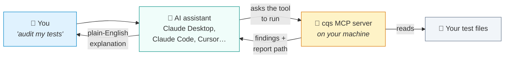
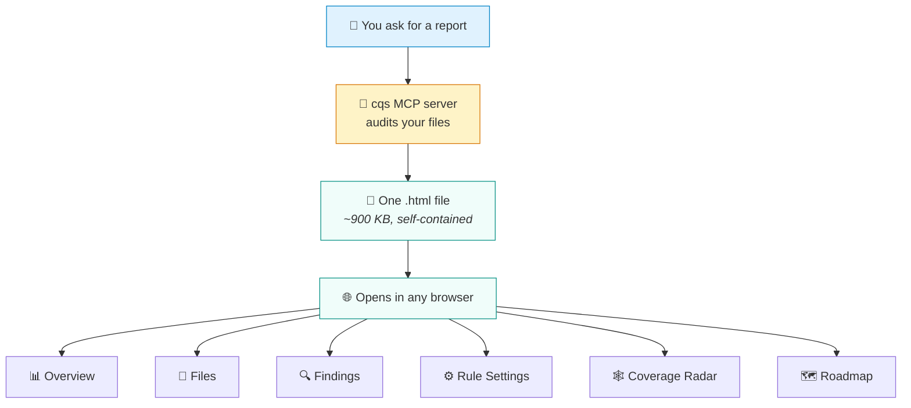

# Using cqs from your AI assistant (MCP) — a guide from scratch

This guide assumes **no prior knowledge**. If you can install an app and edit a
text file, you can finish this in about five minutes.

---

## 1. What problem does this solve?

You already have the `cqs` command. It audits your test files and tells you
what's wrong with them. But you have to remember the commands and read the
output yourself.

MCP lets your **AI assistant** run `cqs` for you. Instead of typing commands,
you say:

> "Audit the tests in my project and show me the report."

…and the assistant runs the audit, reads the results, and explains them.

---

## 2. What is MCP, in plain words?

**MCP (Model Context Protocol) is a way for an AI assistant to use tools on
your computer.**

By default an AI assistant can only talk. It can't read your files or run your
programs. MCP is the socket that lets you plug a tool in. Once plugged in, the
assistant can use it — but only that tool, and only when it decides it's
needed.

A useful analogy: the assistant is a skilled colleague on a phone call. They
can advise you, but they can't touch your laptop. MCP is you sharing your
screen and handing them the keyboard — for one specific program.



**Three things worth knowing:**

| | |
|---|---|
| **It runs on your computer** | Your code is never uploaded anywhere. The server reads local files and hands results back. |
| **It only does what it's built for** | The cqs server can audit files and write reports. It cannot delete, send email, or browse the web. |
| **You stay in control** | The assistant asks before running tools, and you can unplug the server at any time. |

---

## 3. What you get

Seven tools. You never call these by name — you ask in normal language and the
assistant picks the right one.

| Tool | What it does | You'd say… |
|---|---|---|
| `cqs_audit` | Finds problems in your test files | "What's wrong with my tests?" |
| `cqs_report` | Writes a full visual report you can open in a browser | "Show me a report I can share" |
| `cqs_list_stacks` | Lists the 18 supported frameworks | "Which frameworks are supported?" |
| `cqs_list_rules` | Lists the rules for a framework | "What does it check for Playwright?" |
| `cqs_validate_rules` | Checks your custom rules file is valid | "Is my cqs-rules.json correct?" |
| `cqs_test_rule` | Tries a rule before you commit it | "Would this rule catch anything?" |
| `cqs_read_report` | Summarises a saved JSON report | "Summarise last week's report" |

---

## 4. Before you start

You need **Node.js version 18 or newer**. To check, open Terminal and type:

```bash
node --version
```

If you see something like `v24.20.0`, you're fine. If you see "command not
found", install Node from [nodejs.org](https://nodejs.org) first.

---

## 5. Step 1 — Install cqs

```bash
npm install -g cqs-audit
```

The `-g` means "make this available everywhere on my computer". Confirm it
worked:

```bash
cqs --help
```

You should see the help text. If you get "command not found", see
[Troubleshooting](#9-troubleshooting).

---

## 6. Step 2 — Find the server file

The MCP server was installed alongside the command. You need its full path.

```bash
echo "$(npm root -g)/cqs-audit/dist/cqs-mcp.js"
```

This prints something like:

```
/Users/yourname/.nvm/versions/node/v24.20.0/lib/node_modules/cqs-audit/dist/cqs-mcp.js
```

**Copy that line.** You'll paste it in the next step. It will look different on
your machine — that's expected, so use *your* output, not the example.

---

## 7. Step 3 — Tell your assistant about it

Pick whichever you use.

### Claude Desktop

1. Open Claude Desktop
2. Menu: **Claude → Settings → Developer → Edit Config**
   (or edit `~/Library/Application Support/Claude/claude_desktop_config.json`
   directly on a Mac)
3. Make it look like this, pasting **your** path from Step 2:

```json
{
  "mcpServers": {
    "cqs": {
      "command": "node",
      "args": [
        "/Users/yourname/.nvm/versions/node/v24.20.0/lib/node_modules/cqs-audit/dist/cqs-mcp.js"
      ]
    }
  }
}
```

4. **Quit Claude Desktop completely and reopen it.** Closing the window isn't
   enough — use Cmd+Q on a Mac. The config is only read at startup.

> **If the file already has content**, don't replace it. Add `"cqs": { … }`
> inside the existing `"mcpServers"` block, with a comma between entries. JSON
> breaks if you get commas wrong, and a broken config means *no* servers load.

### Claude Code (CLI)

One command, no file editing:

```bash
claude mcp add cqs node "$(npm root -g)/cqs-audit/dist/cqs-mcp.js"
```

### Cursor

Edit `~/.cursor/mcp.json` using the same JSON shape as Claude Desktop above,
then restart Cursor.

---

## 8. Step 4 — Check it worked

Ask your assistant:

> "What cqs tools do you have?"

It should list the seven tools from the table above. Then try it for real:

> "Audit the test files in ./tests and tell me the three worst problems."

And the one most people want:

> "Generate a cqs report for ./tests and give me the file path."

You'll get back a path like `/var/folders/.../cqs-report-1790350130849.html`.
Open it in any browser.

---

## 9. What the report gives you

`cqs_report` doesn't write a plain page — it writes **the whole Code Quality
Studio app into a single file**. No server, no internet, no install. Send it to
a colleague by email and it works on their machine.



Because it can't re-read your source files, the offline copy hides the buttons
that would need them — Run, Open, re-run, the AI providers. You get the views
and the data, nothing that would fail if clicked.

---

## 10. Troubleshooting

**"command not found: cqs" after installing**

Your `PATH` doesn't include npm's global folder, or you installed under a
different Node version. If you use `nvm`, global packages are per-version —
install again after `nvm use`:

```bash
node --version
npm install -g cqs-audit
```

**The assistant doesn't see the tools**

1. Did you fully quit and reopen the app? Config is read only at startup.
2. Is the path in your config exactly what Step 2 printed? Check for typos and
   a missing `.js` at the end.
3. Is your JSON valid? Test it:

```bash
python3 -m json.tool ~/Library/Application\ Support/Claude/claude_desktop_config.json
```

If that reports an error, the file has a syntax problem — usually a missing or
extra comma — and no servers will load.

**Test the server without any assistant**

This proves the server itself works, independently of any app:

```bash
printf '%s\n' '{"jsonrpc":"2.0","id":1,"method":"initialize","params":{"protocolVersion":"2024-11-05","capabilities":{},"clientInfo":{"name":"t","version":"1"}}}' '{"jsonrpc":"2.0","id":2,"method":"tools/list"}' | node "$(npm root -g)/cqs-audit/dist/cqs-mcp.js"
```

A wall of JSON containing `cqs_audit` and `cqs_report` means the server is
healthy, and the problem is in your config or your restart.

**"This build has no embedded app"**

Only happens when building from source. Build the web app first:

```bash
npm run build          # at the repo root
cd cli && node build-mcp.mjs
```

---

## 11. Common questions

**Does my code get sent anywhere?**
No. The server runs locally and reads local files. The rules are plain pattern
matching — no network calls, no API keys needed.

**Do I need an API key?**
Not for any of this. Keys are only for the optional AI second-opinion review,
which is a separate feature.

**Is this different from the `cqs` command?**
Same engine, same 530 rules, same report. MCP just means your assistant can
run it for you instead of you typing commands.

**How do I remove it?**
Delete the `"cqs"` block from your config and restart. To uninstall entirely:
`npm uninstall -g cqs-audit`.

---

## See also

- [ARCHITECTURE_OVERVIEW.md](ARCHITECTURE_OVERVIEW.md) — how the analysis works
- [CUSTOM_RULES_PROPOSAL.md](CUSTOM_RULES_PROPOSAL.md) — writing your own rules
